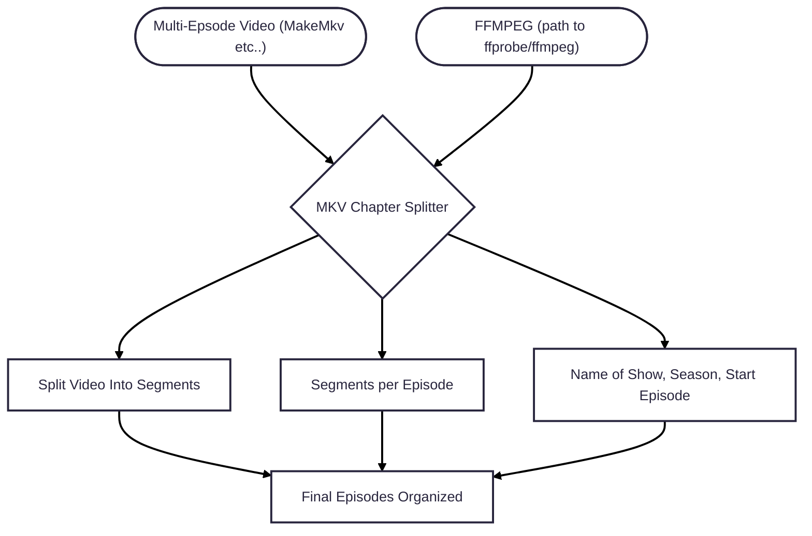

# Chapter Splitter

0. Select FFMPEG "bin" path, (this will need to be downloaded and unzipped first)
1. Select the MKV
2. Update Episodes in File Count
3. Update the File Name Prefix
4. Update Season and Episode Start Number (If applicable)
5. (Ensure you are on the first episode) Update the Chapter Start and End indexes
6. Click Autofill From Here to take the Episode Count and auto-fill the rest of the chapters with the same number
7. Click Split Into episodes to start the process

# Requirements
- FFMPEG https://www.ffmpeg.org/download.html

# Notes
- This will open a ffmpeg per episode to split-
- After all is done you will see the terminal sitting there with nothing running, you can close it then

# Workflow

